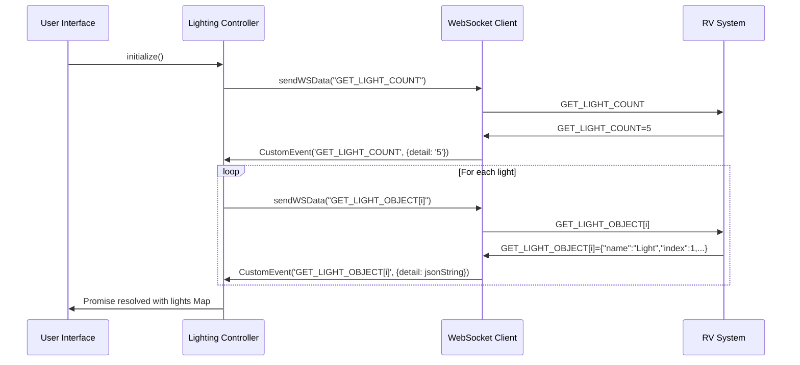

# RV Lighting System Integration Guide

## Table of Contents

- [Overview](#overview)
- [Prerequisites](#prerequisites)
- [Quick Start](#quick-start)
- [Integration Methods](#integration-methods)
- [WebSocket Requirements](#websocket-requirements)
- [Parser Utils Implementation](#parser-utils-implementation)
- [Custom Integrations](#custom-integrations)
- [Testing Integration](#testing-integration)
- [Troubleshooting](#troubleshooting)

## Overview

This guide covers integrating the RV Lighting Scenes & Schedules System with existing RV control systems. The system is designed to work with SilverLeaf Electronics / Newmar RV control systems but can be adapted for other WebSocket-based lighting control systems.

## Prerequisites

### System Requirements

1. **RV Control System**
   - SilverLeaf Electronics compatible system
   - WebSocket communication capability (typically port 8092)
   - PIN-based authentication support

2. **Network Requirements**
   - RV internal network (usually 192.168.1.x)
   - WebSocket server running on control system
   - HTTP/HTTPS access to serve web interface

3. **Software Dependencies**
   - Modern web browser with ES6+ support
   - WebSocket API support
   - Local storage capability

### Development Environment

```bash
# Basic development setup
git clone https://github.com/yourusername/rv-lighting-scenes.git
cd rv-lighting-scenes

# Serve files (simple HTTP server)
python -m http.server 8080
# OR
npx serve .
# OR
php -S localhost:8080
```

## Quick Start

### Method 1: Complete Standalone Implementation

Use the provided HTML file that includes everything:

```html
<!DOCTYPE html>
<html>
<head>
    <title>RV Lighting Control</title>
    <link rel="stylesheet" href="src/lighting-ui.css">
</head>
<body>
    <!-- Use the complete lighting_ui.html file -->
    <script src="src/RVLightingController.js"></script>
    <script src="src/lighting-ui.js"></script>
</body>
</html>
```

### Method 2: Integration with Existing System

Add to your existing RV control interface:

```html
<!-- Include the core controller -->
<script src="src/RVLightingController.js"></script>

<!-- Initialize in your existing JavaScript -->
<script>
let lightingController;

// Initialize after your WebSocket connection is established
function initLightingSystem() {
    lightingController = new RVLightingController();
    
    lightingController.initialize().then(() => {
        console.log('Lighting system ready');
        // Integrate with your existing UI
        updateYourLightingUI();
    }).catch(error => {
        console.error('Lighting system failed:', error);
    });
}
</script>
```

## Integration Methods

### 1. Drop-in Replacement

Replace existing lighting controls entirely:

```html
<!-- Remove existing lighting HTML -->
<!-- <div id="old-lighting-controls">...</div> -->

<!-- Add new lighting system -->
<div id="rv-lighting-container">
    <!-- Include sections from lighting-ui.html -->
</div>

<script src="src/RVLightingController.js"></script>
<script src="src/lighting-ui.js"></script>
```

### 2. Side-by-side Integration

Keep existing controls and add new features:

```html
<div class="control-panels">
    <!-- Your existing controls -->
    <div id="existing-controls">
        <!-- Keep your current lighting controls -->
    </div>
    
    <!-- New advanced features -->
    <div id="advanced-lighting">
        <h3>Scenes & Schedules</h3>
        <!-- Include scene and schedule sections only -->
    </div>
</div>
```

### 3. API-only Integration

Use just the controller without the UI:

```javascript
// Initialize controller
const lightingController = new RVLightingController();
await lightingController.initialize();

// Integrate with your existing controls
document.getElementById('your-light-slider').addEventListener('input', (e) => {
    const lightIndex = e.target.dataset.lightIndex;
    const brightness = e.target.value;
    lightingController.setLightBrightness(lightIndex, brightness);
});

// Add scene functionality to existing buttons
document.getElementById('your-save-button').addEventListener('click', () => {
    const sceneName = prompt('Scene name:');
    lightingController.saveScene(sceneName);
});
```

## WebSocket Requirements

### Required Functions

Your system must provide these functions for the lighting controller to work:

#### 1. `sendWSData(command)`

```javascript
function sendWSData(command) {
    // Your WebSocket implementation
    if (yourWebSocket && yourWebSocket.readyState === WebSocket.OPEN) {
        yourWebSocket.send(command);
        return true;
    }
    return false;
}
```

#### 2. Event Dispatching

The system expects WebSocket responses to trigger events:

```javascript
yourWebSocket.onmessage = function(event) {
    const message = event.data;
    
    // Parse KEY=VALUE messages
    const parts = message.split('=');
    if (parts.length === 2) {
        const customEvent = new CustomEvent(parts[0], { detail: parts[1] });
        document.body.dispatchEvent(customEvent);
    }
    
    // Handle other message formats...
};
```

### WebSocket Message Flow



## Parser Utils Implementation

The system requires a `parserUtils` object with specific functions:

```javascript
const parserUtils = {
    // Pack multiple values into a single hex command
    packEvent: (...args) => {
        let val = args.reduce((prev, curr) => prev | curr);
        let hex = val.toString(16).toUpperCase();
        let padded = hex.padStart(4, '0');
        return `0x${padded}`;
    },
    
    // Set instance in command
    ESET_INSTANCE: (instance) => {
        return (Math.round(instance) & 0xFF) << 8;
    },
    
    // Set brightness value
    ESET_BRIGHTNESS: (brightness) => {
        return Math.round(brightness) & 0xFF;
    },
    
    // Set level value (for on/off)
    ESET_LEVEL: (level) => {
        return (Math.round(level) & 0xF);
    },
    
    // Utility functions
    upad: (n, targetLength = 2) => {
        return n.padStart(targetLength, '0');
    }
};
```

### Custom Parser Implementation

If your system uses different command formats:

```javascript
// Adapter for different command format
const customParserUtils = {
    packEvent: (...args) => {
        // Convert to your system's format
        return yourSystemCommandFormat(args);
    },
    
    ESET_INSTANCE: (instance) => {
        // Map to your instance format
        return yourInstanceMapping(instance);
    },
    
    ESET_BRIGHTNESS: (brightness) => {
        // Map to your brightness format
        return yourBrightnessMapping(brightness);
    },
    
    ESET_LEVEL: (level) => {
        // Map to your level format
        return yourLevelMapping(level);
    }
};

// Make available globally
window.parserUtils = customParserUtils;
```

## Custom Integrations

### 1. Different RV Systems

For non-Newmar systems, modify the command format:

```javascript
class CustomRVLightingController extends RVLightingController {
    setLightBrightness(lightIndex, brightness) {
        const light = this.lights.get(lightIndex);
        if (!light) return false;
        
        // Custom command format for your system
        const command = `YOUR_BRIGHTNESS_COMMAND:${lightIndex}:${brightness}`;
        return sendWSData(command);
    }
    
    async initialize() {
        // Custom discovery process
        return new Promise((resolve) => {
            // Your system's light discovery method
            sendWSData("YOUR_DISCOVERY_COMMAND");
            
            // Handle responses in your format
            this.handleCustomDiscovery(resolve);
        });
    }
}
```

### 2. REST API Integration

For systems using REST instead of WebSocket:

```javascript
class RESTLightingController extends RVLightingController {
    constructor(apiBaseUrl) {
        super();
        this.apiUrl = apiBaseUrl;
    }
    
    async setLightBrightness(lightIndex, brightness) {
        try {
            const response = await fetch(`${this.apiUrl}/lights/${lightIndex}`, {
                method: 'PUT',
                headers: { 'Content-Type': 'application/json' },
                body: JSON.stringify({ brightness })
            });
            return response.ok;
        } catch (error) {
            console.error('REST command failed:', error);
            return false;
        }
    }
    
    async initialize() {
        try {
            const response = await fetch(`${this.apiUrl}/lights`);
            const lightsData = await response.json();
            
            lightsData.forEach(light => {
                this.lights.set(light.id, {
                    name: light.name,
                    index: light.id,
                    room: light.room,
                    isDimmer: light.type === 'dimmer',
                    currentBrightness: light.brightness
                });
            });
            
            this.isInitialized = true;
            return this.lights;
        } catch (error) {
            throw new Error('REST discovery failed: ' + error.message);
        }
    }
}
```

### 3. MQTT Integration

For MQTT-based systems:

```javascript
class MQTTLightingController extends RVLightingController {
    constructor(mqttClient) {
        super();
        this.mqtt = mqttClient;
        this.setupMQTTHandlers();
    }
    
    setupMQTTHandlers() {
        this.mqtt.on('message', (topic, message) => {
            if (topic.startsWith('rv/lights/')) {
                this.handleMQTTMessage(topic, message.toString());
            }
        });
    }
    
    setLightBrightness(lightIndex, brightness) {
        const topic = `rv/lights/${lightIndex}/brightness`;
        this.mqtt.publish(topic, brightness.toString());
        return true;
    }
    
    async initialize() {
        return new Promise((resolve) => {
            // Subscribe to light discovery
            this.mqtt.subscribe('rv/lights/+/status');
            
            // Request light list
            this.mqtt.publish('rv/system/discover', 'lights');
            
            // Handle discovery responses
            setTimeout(() => resolve(this.lights), 5000);
        });
    }
}
```

## Testing Integration

### 1. Mock WebSocket for Development

```javascript
class MockWebSocket {
    constructor() {
        this.readyState = WebSocket.OPEN;
        this.mockLights = [
            { name: "Living Room Main", index: 1, room_loc: 0, command: 0 },
            { name: "Kitchen", index: 2, room_loc: 1, command: 1 },
            { name: "Bedroom", index: 3, room_loc: 2, command: 0 }
        ];
    }
    
    send(command) {
        console.log('Mock command:', command);
        
        // Simulate responses
        setTimeout(() => {
            if (command === "GET_LIGHT_COUNT") {
                this.dispatchResponse("GET_LIGHT_COUNT", this.mockLights.length);
            } else if (command.startsWith("GET_LIGHT_OBJECT[")) {
                const index = parseInt(command.match(/\[(\d+)\]/)[1]);
                if (this.mockLights[index]) {
                    this.dispatchResponse(command.split('=')[0], JSON.stringify(this.mockLights[index]));
                }
            }
        }, 100);
    }
    
    dispatchResponse(eventName, data) {
        const event = new CustomEvent(eventName, { detail: data.toString() });
        document.body.dispatchEvent(event);
    }
}

// Use mock for development
if (location.hostname === 'localhost') {
    window.mockWS = new MockWebSocket();
    window.sendWSData = (cmd) => window.mockWS.send(cmd);
}
```

### 2. Integration Test Suite

```javascript
async function runIntegrationTests() {
    console.log('Starting integration tests...');
    
    // Test 1: WebSocket Communication
    try {
        const testResult = sendWSData("ping");
        console.log('✓ WebSocket communication:', testResult);
    } catch (error) {
        console.error('✗ WebSocket communication failed:', error);
    }
    
    // Test 2: Parser Utils
    try {
        const packed = parserUtils.packEvent(
            parserUtils.ESET_INSTANCE(1),
            parserUtils.ESET_BRIGHTNESS(100)
        );
        console.log('✓ Parser utils working:', packed);
    } catch (error) {
        console.error('✗ Parser utils failed:', error);
    }
    
    // Test 3: Controller Initialization
    try {
        const controller = new RVLightingController();
        await controller.initialize();
        console.log('✓ Controller initialization:', controller.lights.size, 'lights');
    } catch (error) {
        console.error('✗ Controller initialization failed:', error);
    }
    
    // Test 4: Light Control
    try {
        const success = controller.setLightBrightness(1, 50);
        console.log('✓ Light control:', success);
    } catch (error) {
        console.error('✗ Light control failed:', error);
    }
    
    console.log('Integration tests completed');
}

// Run tests on page load
document.addEventListener('DOMContentLoaded', () => {
    if (window.location.search.includes('test=true')) {
        runIntegrationTests();
    }
});
```

### 3. Compatibility Checker

```javascript
function checkCompatibility() {
    const results = {
        websocket: typeof WebSocket !== 'undefined',
        localStorage: typeof localStorage !== 'undefined',
        customEvents: typeof CustomEvent !== 'undefined',
        es6Classes: (function() {
            try {
                eval('class TestClass {}');
                return true;
            } catch (e) {
                return false;
            }
        })(),
        asyncAwait: (function() {
            try {
                eval('async function test() { await Promise.resolve(); }');
                return true;
            } catch (e) {
                return false;
            }
        })(),
        sendWSData: typeof sendWSData === 'function',
        parserUtils: typeof parserUtils === 'object'
    };
    
    console.table(results);
    
    const incompatible = Object.entries(results)
        .filter(([key, value]) => !value)
        .map(([key]) => key);
    
    if (incompatible.length > 0) {
        console.warn('Compatibility issues:', incompatible);
        return false;
    }
    
    console.log('✓ All compatibility checks passed');
    return true;
}
```

## Troubleshooting

### Common Integration Issues

#### 1. WebSocket Not Connecting

```javascript
// Debug WebSocket connection
function debugWebSocketConnection() {
    const ws = new WebSocket('ws://192.168.1.100:8092/');
    
    ws.onopen = () => console.log('✓ WebSocket connected');
    ws.onerror = (error) => console.error('✗ WebSocket error:', error);
    ws.onclose = (event) => console.log('WebSocket closed:', event.code, event.reason);
    
    setTimeout(() => {
        if (ws.readyState !== WebSocket.OPEN) {
            console.error('WebSocket failed to connect within timeout');
        }
    }, 5000);
}
```

#### 2. Commands Not Working

```javascript
// Test command sending
function testCommands() {
    const commands = [
        "GET_LIGHT_COUNT",
        "GET_LIGHT_OBJECT[0]",
        "ping"
    ];
    
    commands.forEach(cmd => {
        console.log(`Sending: ${cmd}`);
        const result = sendWSData(cmd);
        console.log(`Result: ${result}`);
    });
}
```

#### 3. Event Handling Issues

```javascript
// Debug event handling
function debugEvents() {
    const originalDispatch = document.body.dispatchEvent;
    
    document.body.dispatchEvent = function(event) {
        console.log('Event dispatched:', event.type, event.detail);
        return originalDispatch.call(this, event);
    };
    
    // Test event
    const testEvent = new CustomEvent('TEST_EVENT', { detail: 'test data' });
    document.body.dispatchEvent(testEvent);
}
```

### Performance Optimization

#### 1. Lazy Loading

```javascript
// Load lighting system only when needed
async function loadLightingSystem() {
    if (!window.RVLightingController) {
        await import('./src/RVLightingController.js');
    }
    
    if (!window.lightingController) {
        window.lightingController = new RVLightingController();
        await window.lightingController.initialize();
    }
    
    return window.lightingController;
}

// Use on demand
document.getElementById('lighting-tab').addEventListener('click', async () => {
    const controller = await loadLightingSystem();
    // Show lighting interface
});
```

#### 2. Event Debouncing

```javascript
// Debounce rapid UI changes
function debounce(func, wait) {
    let timeout;
    return function executedFunction(...args) {
        const later = () => {
            clearTimeout(timeout);
            func(...args);
        };
        clearTimeout(timeout);
        timeout = setTimeout(later, wait);
    };
}

// Debounced scene saving
const debouncedSaveScene = debounce((sceneName) => {
    lightingController.saveScene(sceneName);
}, 1000);
```

#### 3. Memory Management

```javascript
// Clean up when not needed
function cleanupLightingSystem() {
    if (window.lightingController) {
        window.lightingController.cleanup();
        window.lightingController = null;
    }
}

// Clean up on page unload
window.addEventListener('beforeunload', cleanupLightingSystem);
```

### Error Recovery

```javascript
// Automatic error recovery
class RobustLightingController extends RVLightingController {
    constructor() {
        super();
        this.maxRetries = 3;
        this.retryDelay = 1000;
        this.connectionHealth = true;
    }
    
    async setLightBrightness(lightIndex, brightness, retryCount = 0) {
        try {
            const success = super.setLightBrightness(lightIndex, brightness);
            if (!success && retryCount < this.maxRetries) {
                await this.delay(this.retryDelay);
                return this.setLightBrightness(lightIndex, brightness, retryCount + 1);
            }
            return success;
        } catch (error) {
            this.log(`Light control error (attempt ${retryCount + 1}):`, error);
            
            if (retryCount < this.maxRetries) {
                await this.delay(this.retryDelay);
                return this.setLightBrightness(lightIndex, brightness, retryCount + 1);
            }
            
            return false;
        }
    }
    
    async initialize() {
        try {
            return await super.initialize();
        } catch (error) {
            this.error('Initialization failed, attempting recovery...', error);
            
            // Wait and retry
            await this.delay(5000);
            return this.initialize();
        }
    }
    
    delay(ms) {
        return new Promise(resolve => setTimeout(resolve, ms));
    }
}
```

## Security Considerations

### 1. PIN Security

```javascript
// Secure PIN handling
class SecurePINHandler {
    constructor() {
        this.maxAttempts = 3;
        this.lockoutTime = 300000; // 5 minutes
        this.attempts = 0;
        this.lockedUntil = null;
    }
    
    isLocked() {
        if (this.lockedUntil && Date.now() < this.lockedUntil) {
            return true;
        }
        this.lockedUntil = null;
        return false;
    }
    
    attemptPIN(pin) {
        if (this.isLocked()) {
            throw new Error('PIN entry locked due to too many attempts');
        }
        
        // Don't store PIN in memory longer than necessary
        const success = this.validatePIN(pin);
        
        if (!success) {
            this.attempts++;
            if (this.attempts >= this.maxAttempts) {
                this.lockedUntil = Date.now() + this.lockoutTime;
                throw new Error('Too many PIN attempts - locked for 5 minutes');
            }
        } else {
            this.attempts = 0;
        }
        
        return success;
    }
    
    validatePIN(pin) {
        // Clear PIN from memory immediately after use
        const result = sendWSData(`PIN=${pin}`);
        pin = null; // Clear variable
        return result;
    }
}
```

### 2. Input Validation

```javascript
// Validate all inputs
function validateLightIndex(index) {
    if (typeof index !== 'number' || index < 1 || index > 255) {
        throw new Error('Invalid light index');
    }
    return Math.floor(index);
}

function validateBrightness(brightness) {
    if (typeof brightness !== 'number' || brightness < 0 || brightness > 100) {
        throw new Error('Invalid brightness value');
    }
    return Math.floor(brightness);
}

function validateSceneName(name) {
    if (typeof name !== 'string' || name.length === 0 || name.length > 50) {
        throw new Error('Invalid scene name');
    }
    // Sanitize for storage
    return name.replace(/[<>\"'&]/g, '');
}
```

### 3. Network Security

```javascript
// Secure WebSocket connection
function createSecureWebSocket(host, port, useSSL = false) {
    const protocol = useSSL ? 'wss' : 'ws';
    const url = `${protocol}://${host}:${port}/`;
    
    // Validate host
    if (!/^(\d{1,3}\.){3}\d{1,3}$/.test(host)) {
        throw new Error('Invalid host format');
    }
    
    // Validate port
    if (port < 1 || port > 65535) {
        throw new Error('Invalid port number');
    }
    
    const ws = new WebSocket(url);
    
    // Set up security headers if possible
    ws.addEventListener('open', () => {
        console.log('Secure connection established');
    });
    
    return ws;
}
```

## Deployment Guide

### 1. Production Build

Create a minified production version:

```html
<!DOCTYPE html>
<html lang="en">
<head>
    <meta charset="UTF-8">
    <meta name="viewport" content="width=device-width, initial-scale=1.0">
    <title>RV Lighting Control</title>
    
    <!-- Production CSS -->
    <link rel="stylesheet" href="dist/lighting-ui.min.css">
    
    <!-- Security headers -->
    <meta http-equiv="Content-Security-Policy" content="default-src 'self'; script-src 'self' 'unsafe-inline'; style-src 'self' 'unsafe-inline';">
</head>
<body>
    <!-- Your lighting interface HTML -->
    
    <!-- Production JavaScript -->
    <script src="dist/RVLightingController.min.js"></script>
    <script src="dist/lighting-ui.min.js"></script>
    
    <script>
        // Production initialization
        if ('serviceWorker' in navigator) {
            navigator.serviceWorker.register('/sw.js');
        }
    </script>
</body>
</html>
```

### 2. Service Worker for Offline Support

```javascript
// sw.js - Service Worker
const CACHE_NAME = 'rv-lighting-v1.0.0';
const STATIC_ASSETS = [
    '/',
    '/src/RVLightingController.js',
    '/src/lighting-ui.css',
    '/src/lighting-ui.js',
    '/lighting-ui.html'
];

self.addEventListener('install', (event) => {
    event.waitUntil(
        caches.open(CACHE_NAME)
            .then(cache => cache.addAll(STATIC_ASSETS))
    );
});

self.addEventListener('fetch', (event) => {
    event.respondWith(
        caches.match(event.request)
            .then(response => response || fetch(event.request))
    );
});
```

### 3. Configuration Management

```javascript
// config.js - Environment-specific configuration
const RVLightingConfig = {
    development: {
        debug: true,
        mockData: true,
        wsHost: 'localhost',
        wsPort: 8092,
        useSSL: false
    },
    
    production: {
        debug: false,
        mockData: false,
        wsHost: '192.168.1.100',
        wsPort: 8092,
        useSSL: false
    },
    
    // Auto-detect environment
    current: location.hostname === 'localhost' ? 'development' : 'production'
};

// Use configuration
const config = RVLightingConfig[RVLightingConfig.current];
```

### 4. Update Mechanism

```javascript
// Check for updates
class UpdateManager {
    constructor() {
        this.currentVersion = '1.0.0';
        this.updateCheckInterval = 3600000; // 1 hour
        this.checkForUpdates();
    }
    
    async checkForUpdates() {
        try {
            const response = await fetch('/version.json');
            const versionInfo = await response.json();
            
            if (this.isNewerVersion(versionInfo.version, this.currentVersion)) {
                this.promptForUpdate(versionInfo);
            }
        } catch (error) {
            console.log('Update check failed:', error);
        }
        
        setTimeout(() => this.checkForUpdates(), this.updateCheckInterval);
    }
    
    isNewerVersion(remote, local) {
        const remoteNumbers = remote.split('.').map(Number);
        const localNumbers = local.split('.').map(Number);
        
        for (let i = 0; i < Math.max(remoteNumbers.length, localNumbers.length); i++) {
            const r = remoteNumbers[i] || 0;
            const l = localNumbers[i] || 0;
            
            if (r > l) return true;
            if (r < l) return false;
        }
        
        return false;
    }
    
    promptForUpdate(versionInfo) {
        if (confirm(`New version ${versionInfo.version} available. Update now?`)) {
            location.reload(true);
        }
    }
}

// Start update checking
new UpdateManager();
```

## Migration Guide

### From Existing Systems

#### 1. Data Migration

```javascript
// Migrate from old lighting data format
function migrateOldData() {
    const oldData = localStorage.getItem('old_lighting_scenes');
    if (!oldData) return;
    
    try {
        const oldScenes = JSON.parse(oldData);
        const newScenes = new Map();
        
        oldScenes.forEach(oldScene => {
            const newScene = {
                name: oldScene.name,
                created: oldScene.timestamp || new Date().toISOString(),
                room: null,
                lights: oldScene.settings.map(setting => ({
                    index: setting.lightId,
                    name: setting.lightName,
                    brightness: setting.level,
                    room: setting.room || 0
                }))
            };
            
            newScenes.set(newScene.name, newScene);
        });
        
        // Save in new format
        const lightingController = new RVLightingController();
        lightingController.scenes = newScenes;
        lightingController.saveToStorage();
        
        // Remove old data
        localStorage.removeItem('old_lighting_scenes');
        
        console.log(`Migrated ${newScenes.size} scenes to new format`);
    } catch (error) {
        console.error('Migration failed:', error);
    }
}
```

#### 2. Gradual Migration

```javascript
// Run both systems in parallel during migration
class MigrationWrapper {
    constructor(oldSystem, newSystem) {
        this.old = oldSystem;
        this.new = newSystem;
        this.useNewSystem = false;
    }
    
    async enableNewSystem() {
        try {
            await this.new.initialize();
            this.useNewSystem = true;
            console.log('✓ New lighting system enabled');
        } catch (error) {
            console.error('New system failed, using fallback:', error);
            this.useNewSystem = false;
        }
    }
    
    setLightBrightness(lightIndex, brightness) {
        if (this.useNewSystem) {
            return this.new.setLightBrightness(lightIndex, brightness);
        } else {
            return this.old.setLightBrightness(lightIndex, brightness);
        }
    }
    
    saveScene(sceneName) {
        if (this.useNewSystem) {
            return this.new.saveScene(sceneName);
        } else {
            // Convert to old format
            return this.old.saveScene(sceneName);
        }
    }
}

// Usage
const migrationWrapper = new MigrationWrapper(oldLightingSystem, new RVLightingController());
await migrationWrapper.enableNewSystem();
```

## Best Practices

### 1. Error Handling

```javascript
// Comprehensive error handling
class ErrorHandler {
    static handle(error, context = 'Unknown') {
        console.error(`[${context}] Error:`, error);
        
        // Log to system if available
        if (window.rvLogger) {
            window.rvLogger.error(context, error.message, error.stack);
        }
        
        // Show user-friendly message
        const userMessage = this.getUserMessage(error);
        if (window.showNotification) {
            window.showNotification(userMessage, 'error');
        }
        
        // Attempt recovery
        this.attemptRecovery(error, context);
    }
    
    static getUserMessage(error) {
        const errorMap = {
            'INIT_TIMEOUT': 'Connection timeout. Please check your RV controller.',
            'LIGHT_NOT_FOUND': 'Light not found. Please refresh the light list.',
            'SCENE_NOT_FOUND': 'Scene not found. It may have been deleted.',
            'COMMAND_FAILED': 'Command failed. Please check your connection.'
        };
        
        return errorMap[error.message] || 'An unexpected error occurred.';
    }
    
    static attemptRecovery(error, context) {
        switch (error.message) {
            case 'INIT_TIMEOUT':
                // Attempt reconnection
                setTimeout(() => {
                    if (window.lightingController) {
                        window.lightingController.initialize();
                    }
                }, 5000);
                break;
                
            case 'COMMAND_FAILED':
                // Check connection health
                if (window.checkConnection) {
                    window.checkConnection();
                }
                break;
        }
    }
}

// Use error handler globally
window.addEventListener('error', (event) => {
    ErrorHandler.handle(event.error, 'Global');
});
```

### 2. Performance Monitoring

```javascript
// Monitor system performance
class PerformanceMonitor {
    constructor() {
        this.metrics = {
            initTime: 0,
            commandLatency: [],
            memoryUsage: 0,
            errorCount: 0
        };
        
        this.startMonitoring();
    }
    
    startMonitoring() {
        // Monitor initialization time
        const initStart = performance.now();
        document.addEventListener('lightingSystemReady', () => {
            this.metrics.initTime = performance.now() - initStart;
        });
        
        // Monitor memory usage
        setInterval(() => {
            if (performance.memory) {
                this.metrics.memoryUsage = performance.memory.usedJSHeapSize;
            }
        }, 30000);
        
        // Report metrics periodically
        setInterval(() => this.reportMetrics(), 300000); // 5 minutes
    }
    
    recordCommandLatency(startTime) {
        const latency = performance.now() - startTime;
        this.metrics.commandLatency.push(latency);
        
        // Keep only last 100 measurements
        if (this.metrics.commandLatency.length > 100) {
            this.metrics.commandLatency.shift();
        }
    }
    
    recordError() {
        this.metrics.errorCount++;
    }
    
    reportMetrics() {
        const avgLatency = this.metrics.commandLatency.reduce((a, b) => a + b, 0) / this.metrics.commandLatency.length;
        
        console.log('Performance Metrics:', {
            initTime: `${this.metrics.initTime}ms`,
            avgCommandLatency: `${avgLatency.toFixed(2)}ms`,
            memoryUsage: `${(this.metrics.memoryUsage / 1024 / 1024).toFixed(2)}MB`,
            errorCount: this.metrics.errorCount
        });
    }
}

// Start performance monitoring
const performanceMonitor = new PerformanceMonitor();
```

### 3. Testing in Production

```javascript
// A/B testing for features
class FeatureFlags {
    constructor() {
        this.flags = this.loadFlags();
    }
    
    loadFlags() {
        return {
            enhancedScheduling: this.getUserFlag('enhanced_scheduling', 0.5),
            autoScenes: this.getUserFlag('auto_scenes', 0.1),
            voiceControl: this.getUserFlag('voice_control', 0.0)
        };
    }
    
    getUserFlag(flagName, rolloutPercentage) {
        const userId = this.getUserId();
        const hash = this.simpleHash(userId + flagName);
        return (hash % 100) < (rolloutPercentage * 100);
    }
    
    getUserId() {
        let userId = localStorage.getItem('rv_user_id');
        if (!userId) {
            userId = 'user_' + Math.random().toString(36).substr(2, 9);
            localStorage.setItem('rv_user_id', userId);
        }
        return userId;
    }
    
    simpleHash(str) {
        let hash = 0;
        for (let i = 0; i < str.length; i++) {
            const char = str.charCodeAt(i);
            hash = ((hash << 5) - hash) + char;
            hash = hash & hash; // Convert to 32-bit integer
        }
        return Math.abs(hash);
    }
    
    isEnabled(flagName) {
        return this.flags[flagName] || false;
    }
}

// Use feature flags
const featureFlags = new FeatureFlags();

if (featureFlags.isEnabled('enhancedScheduling')) {
    // Enable enhanced scheduling features
    console.log('Enhanced scheduling enabled for this user');
}
```

This comprehensive integration guide covers everything needed to successfully integrate the RV Lighting System with existing or new RV control systems. The modular approach allows for different levels of integration based on specific needs and existing infrastructure.